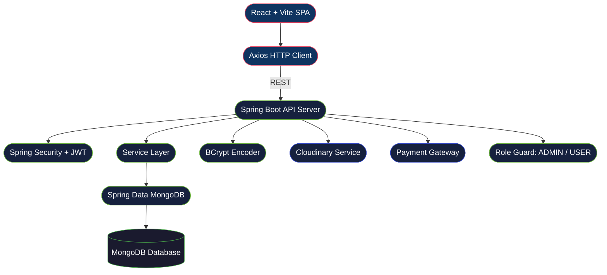

<div align="center">


<br/>


<br/><br/>

<a href="https://github.com/Saikaranam-70/SaGa"></a>
<a href="https://github.com/Saikaranam-70/SaGaBackend"></a>


<br/><br/>


<br/><br/>


</div>

<br/>

<div align="center">

</div>

<br/>

## 💡 What is SaGa?

<div align="center">

```
  Browse  ──▶  Search  ──▶  Add to Cart  ──▶  Pay  ──▶  Track Order
```

</div>

**SaGa** is a complete end-to-end e-commerce web application delivering a seamless, secure, and modern shopping experience. It ships with a fully integrated **Payment Gateway**, a dedicated **Admin Panel**, product management, cart operations, order processing, and **Cloudinary** image handling — all secured by Spring Security + JWT authentication.

<br/>

<div align="center">

</div>

<br/>

## 🧩 User vs Admin

<table>
<tr>
<th align="center" width="50%">🧑‍💻 User Side</th>
<th align="center" width="50%">🛠️ Admin Panel</th>
</tr>
<tr>
<td>

- 🔐 Secure Register & Login
- 🛍️ Browse product catalog
- 🔎 Search & filter products
- 🛒 Cart — add, update, remove
- 💳 Checkout via Payment Gateway
- 📦 Place & track orders
- 👤 Manage personal profile

</td>
<td>

- ➕ Add / Edit / Delete products
- 🖼️ Upload images via Cloudinary
- 📋 View & manage all orders
- 👥 Manage users & roles
- 📊 Dashboard overview
- 💰 Monitor payments & transactions
- 🔒 Protected admin-only routes

</td>
</tr>
</table>

<br/>

<div align="center">

</div>

<br/>

## 🏗️ Architecture



<br/>

<div align="center">

</div>

<br/>

## ✨ Features

<div align="center">

| Feature | Description |
|---|---|
| 🛍️ **Product Catalog** | Browse with categories, images & pricing |
| 🔎 **Search & Filters** | Keyword-based product discovery |
| 🛒 **Cart System** | Add, update quantity, remove items |
| 💳 **Payment Gateway** | Secure integrated payment at checkout |
| 📦 **Order Management** | Place and track order history |
| 🛠️ **Admin Panel** | Full dashboard — products, orders, users |
| 👤 **Authentication** | JWT-secured login & registration |
| 🔐 **Role-Based Access** | Admin and User permission separation |
| 🖼️ **Image Upload** | Cloudinary-powered product images |
| 🔑 **Password Security** | BCrypt-encrypted credentials |
| 📱 **Responsive UI** | Mobile & desktop optimized |

</div>

<br/>

<div align="center">

</div>

<br/>

## 🛠️ Tech Stack

<div align="center">

### Frontend


### Backend


### Cloud · Security · Tools


> **Cloudinary** &nbsp;·&nbsp; **Spring Security** &nbsp;·&nbsp; **JWT** &nbsp;·&nbsp; **BCrypt** &nbsp;·&nbsp; **Payment Gateway**

</div>

<br/>

<div align="center">

</div>

<br/>

## 📂 Project Structure

<table>
<tr>
<th align="center">🔹 Frontend — <a href="https://github.com/Saikaranam-70/SaGa">SaGa</a></th>
<th align="center">🔸 Backend — <a href="https://github.com/Saikaranam-70/SaGaBackend">SaGaBackend</a></th>
</tr>
<tr>
<td>

```
SaGa/
├── src/
│   ├── components/
│   ├── pages/
│   ├── services/
│   └── assets/
├── index.html
├── eslint.config.js
├── vite.config.js
├── package.json
├── package-lock.json
└── .gitignore
```

</td>
<td>

```
SaGaBackend/
├── .mvn/wrapper/
├── src/main/java/
│   ├── controller/
│   ├── service/
│   ├── repository/
│   ├── model/
│   ├── security/
│   └── config/
├── uploads/
├── mvnw
├── mvnw.cmd
├── pom.xml
└── .gitignore
```

</td>
</tr>
</table>

<br/>

<div align="center">

</div>

<br/>

## ⚙️ Getting Started

### Prerequisites
```
Node.js  >= 16     Java  >= 17
Maven    >= 3.8    MongoDB >= 5.x
```

### 1 · Frontend
```bash
git clone https://github.com/Saikaranam-70/SaGa.git
cd SaGa
npm install
npm run dev
```

### 2 · Backend
```bash
git clone https://github.com/Saikaranam-70/SaGaBackend.git
cd SaGaBackend
mvn clean install
mvn spring-boot:run
```

<br/>

<div align="center">

</div>

<br/>

## 🔑 Environment Variables

### `application.properties`
```properties
server.port=8080

# MongoDB
spring.data.mongodb.uri=mongodb://localhost:27017/saga_ecommerce

# JWT
jwt.secret=your_super_secret_key
jwt.expiration=86400000

# Cloudinary
cloudinary.cloud-name=your_cloud_name
cloudinary.api-key=your_api_key
cloudinary.api-secret=your_api_secret

# Payment Gateway
payment.gateway.key=your_payment_key
payment.gateway.secret=your_payment_secret
```

### Frontend `.env`
```env
VITE_API_BASE_URL=http://localhost:8080/api
```

<br/>

<div align="center">

</div>

<br/>

## 🎯 Upcoming Enhancements

```
📊  Advanced Admin Analytics with Charts
⭐  Product Ratings & Reviews
🔔  Real-time Order Notifications
🔁  Wishlist & Save for Later
📧  Order Confirmation Emails
☁️  Full Cloud Deployment (AWS / Render)
📱  React Native Mobile App
🗺️  Google Maps Delivery Tracking
```

<br/>

<div align="center">

</div>

<br/>

## 📊 GitHub Stats

<div align="center">

  
</div>

<div align="center">

</div>

<br/>

<div align="center">

</div>

<br/>

## 🤝 Contributing

```bash
1.  Fork the repo
2.  git checkout -b feature/YourFeature
3.  git commit -m "Add YourFeature"
4.  git push origin feature/YourFeature
5.  Open a Pull Request
```

<br/>

## 👨‍💻 Author

<div align="center">


### Sai Karanam
*Full Stack Developer &nbsp;|&nbsp; React · Spring Boot · MongoDB*

<br/>

[](https://github.com/Saikaranam-70)
&nbsp;
[](https://github.com/Saikaranam-70/SaGa)
&nbsp;
[](https://github.com/Saikaranam-70/SaGaBackend)

</div>

<br/>

## 🐍 Contribution Graph

<div align="center">
   
</div>

<br/>

<div align="center">

### ⭐ If SaGa inspired you, leave a star — it means a lot!


</div>
